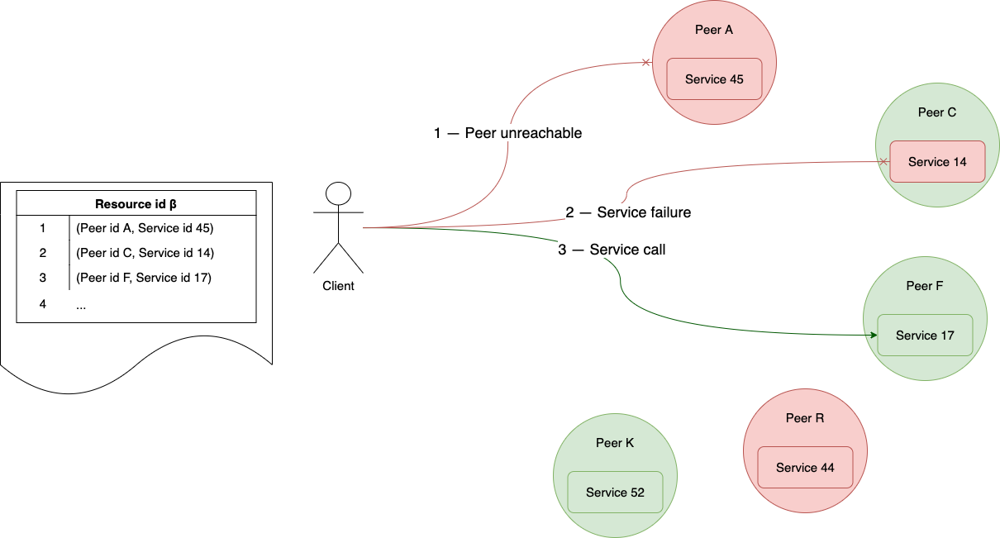
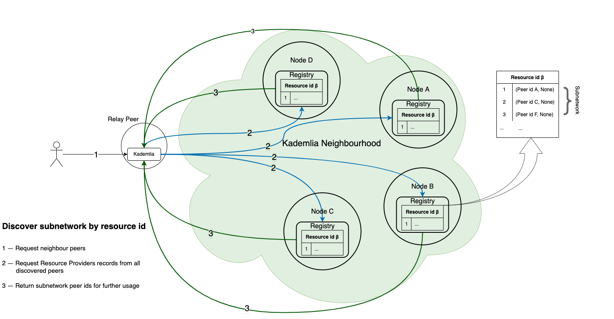

# How to Use Registry in Aqua

## How to install
If you use Fluence CLI you can define dependency in `fluence.yaml`:
```yaml
dependencies:
  npm:
    "@fluencelabs/registry": 0.6.2
```
And then run `fluence dep i`

If you are developing from scratch without Fluence CLI, you should install it via npm:

```bash
npm i @fluencelabs/registry@nightly
```

## How to import

```rust
import "@fluencelabs/registry/resources-api.aqua"
import "@fluencelabs/registry/registry-service.aqua"

func myFunction(resource_id: string) ->  ?[]Record, *Error:
   result, errors <- resolveResource(resource_id, 2)
   <- result, errors
```

## How to create a Resource
- `createResource(label: string) -> ?ResourceId, *Error`

Let's register a resource with the label `sample` by `INIT_PEER_ID`:
```rust
func my_resource() -> ?ResourceId, *Error:
   id, errors <- createResource("sample")
   <- id, errors
```

- `label` is a unique string for the peer id
- creation is successful if a resource id is returned
- `*Error` accumulates errors from all the affected peers

## How to remove a Resource

For now there is no method for Resource removal but it can be expired and garbage-collected if it doesn't have any actual records. In the future updates it can be changed.

## How to register a service
  ```
  registerService(resource_id: ResourceId, value: string, peer_id: string service_id: ?string) -> bool, *Error
  ```

Let's register a local service `greeting` and pass a random string `hi` as a value:
```rust
func registerLocalService(resource_id: ResourceId) -> bool, *Error:
   success, errors <- registerService(resource_id, "hi", INIT_PEER_ID, ?[greeting])
   <- success, errors
```


Let's register a service `echo` hosted on `peer_id` and pass a random string like `sample` as a value:
```rust
func registerExternalService(resource_id: ResourceId, peer_id: PeerId) -> bool, *Error:
   success, errors <- registerService(resource_id, "hi", peer_id, ?[greeting])
   <- success, errors
```

- `value` is a user-defined string that can be used at the discretion of the user
- to update the service record, you should register it again to create a record with a newer timestamp
- service record will be automatically updated till deleted via `unregisterService`


## How to unregister a service
```
func unregisterService(resource_id: ResourceId, peer_id: PeerId) -> bool, *Error:
```
Let's remove a service record from a target node:
```rust
func stopProvideExternalService(resource_id: ResourceId, peer_id: PeerId):
   unregisterService(resource_id, peer_id)
```

- it will be removed from the target node and eventually from the network

## How to resolve service records
- `resolveResource(resource_id: ResourceId, ack: i16) -> ?[]Record, *Error`

Let's resolve all service records for our resource_id:
```rust
func getMyRecords(resource_id: ResourceId, consistency_level: i16) -> ?[]Record, *Error:
   records, error <- resolveResource(resource_id, consistency_level)
   <- records, error
```

- `ack` represents a minimal number of peers that requested for known records

## How to execute a callback on Resource
- `executeOnResource(resource_id: ResourceId, ack: i16, call: Record -> ()) -> bool, *Error`

```rust
func callProvider(r: Record):
   -- topological move to a provider via relay
   on r.metadata.peer_id via r.metadata.relay_id:
       -- resolve and call your service on a provider
       MyService r.metadata.service_id!
       MyService.do_smth()

-- call on every provider
func callEveryone(resource_id: ResourceId, ack: i16) -> bool, *Error:
   success, errors <- executeOnResource(resource_id, ack, callProvider)
```

- it is a combination of `resolveResource` and a `for` loop through records with the callback execution
- it can be useful in case of broadcasting events

## Replication

Resources with corresponding records and tombstones are automatically and periodically replicated to the Kademlia neighborhood of `resource_id`.

## Remarks

You can redefine [`INITIAL_REPLICATION_FACTOR`](https://github.com/fluencelabs/registry/blob/main/aqua/resources-api.aqua#L10) and [`CONSISTENCY_LEVEL`](https://github.com/fluencelabs/registry/blob/main/aqua/resources-api.aqua#L11). The first constant is used to define the number of peers to which data will be replicated during the API call. This constant doesn't affect the network-wide replication factor, which is defined by Kademlia. The second constant defines the minimal number of peers requested to obtain the data.

## Use cases

### Services discovery
Discover services without prior knowledge about exact peers and service identifiers.

### Service high-availability
A service provided by several peers still will be available for the client in case of disconnections and other providers' failures.



### Subnetwork discovery
You can register a group of peers for a resource (without specifying any services). So you "tag" and group the nodes to create a subnetwork.



### Load balancer
If you have a list of service records updated in runtime, you can create a load-balancing service based on your preferred metrics.


