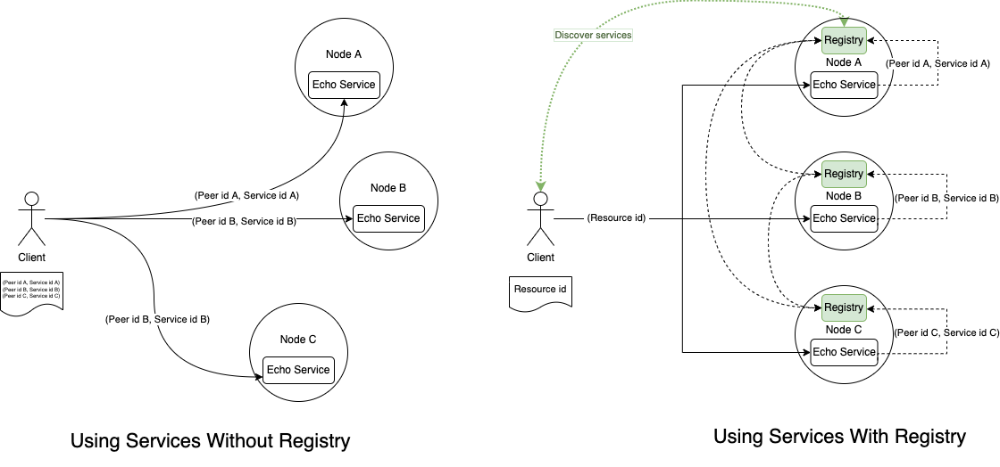
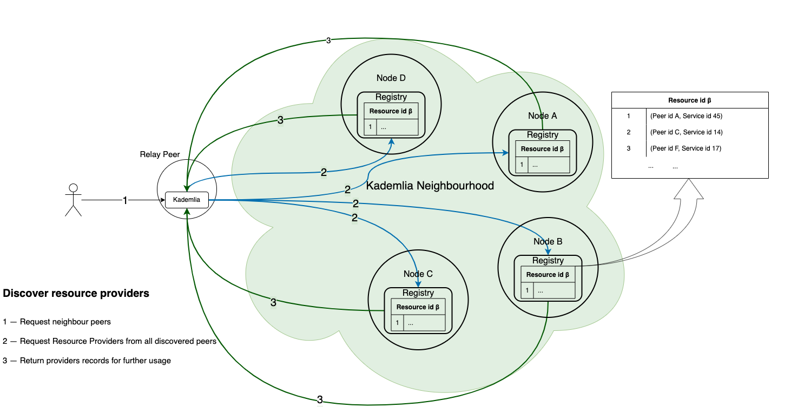
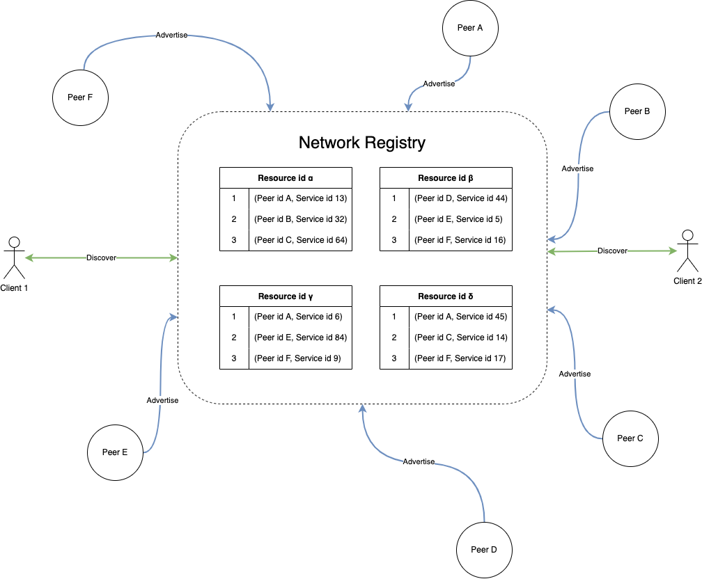

# Registry

- [Registry](#registry)
  - [Overview](#overview)
  - [Why is it important?](#why-is-it-important)
  - [What is it?](#what-is-it)
  - [How to Use it in Aqua](#how-to-use-it-in-aqua)
    - [How to import](#how-to-import)
    - [How to create Resource](#how-to-create-resource)
    - [How to register a service](#how-to-register-a-service)
    - [How to unregister a service](#how-to-unregister-a-service)
    - [How to resolve service records](#how-to-resolve-service-records)
    - [How to execute a callback on Resource](#how-to-execute-a-callback-on-resource)
    - [Notes](#notes)
  - [Use cases](#use-cases)
    - [Services discovery](#services-discovery)
    - [Service high-availability](#service-high-availability)
    - [Subnetwork discovery](#subnetwork-discovery)
    - [Load balancer](#load-balancer)
  - [API](#api)
  - [References](#references)
    - [Learn Aqua](#learn-aqua)

## Overview

There are many [services](https://doc.fluence.dev/docs/concepts#services) in the network on different peers, and there should be a way to find and resolve these services in runtime without prior knowledge about exact service providers. Such approach gives robustness and flexibility to our solutions in terms of discovery, redundancy and high availability.

In centralized systems, we can have centralized storage and routing, but in p2p decentralized environments, the problem becomes more challenging. Registry is our view on the solution for the problem.



## Why is it important?

Scalability, redundancy and high availability are essential parts of a decentralized system, but they are not available out of the box. To enable them, information about services should be bound with peers providing them. Also, such networks are constantly changing, and those changes should be reflected and resolvable in runtime to provide uninterruptible access. So there's a need to have a decentralized protocol to update and resolve information about routing, both global and local.

## What is it?

Registry is available (built-in) on every Fluence node, and it provides service advertisement and discovery. The component allows of creating relationships between unique identifiers and groups of services on various peers. So service providers can either join or disconnect during runtime and be discoverable on the network.

However, Registry is not a plain KV-storage. Instead, it is a composition of the Registry service for each network participant and the scheduled scripts maintaining replication and garbage collection.

So, if you want to discover a group of services on different peers without prior knowledge in runtime, you should register a **Resource**. A resource is a group of services or peers united by some common feature. Please notice that resource lifetime is ~24 hours. However, if the resource has been accessed recently, its lifetime is prolonged, and it will not be garbage-collected for the next 24 hours from the last access.

Service is represented by a combination of `service_id` and `peer_id`, it is called **Record**.




There is no permissions management at the moment, but in the coming updates, a resource owner will be able to provide a challenge to check against.

## How to Use it in Aqua

### How to import
```rust
import "@fluencelabs/registry/resources-api.aqua"
import "@fluencelabs/registry/registry-service.aqua"

func my_function(resource_id: string) ->  []Record, *Error:
   result, error <- resolveResource(resource_id, 2)
   <- result, error
```

### How to create Resource
- `createResource(label: string) -> ?ResourceId, *Error`

Let's register a resource with the label `sample` by `INIT_PEER_ID`:
```rust
func my_resource() -> ?ResourceId, *Error:
   id, error <- createResource("sample")
   <- id, error
```

- `label` is a unique string for the peer id
- creation is successful if a resource id is returned
- `*Error` accumulates errors from all the affected peers
### How to register a service
  ```
  registerServiceRecord(resource_id: ResourceId, value: string, peer_id: string service_id: ?string) -> bool, *Error
  ```

Let's register a local service `greeting` and pass a random string `hi` as a value:
```rust
func register_local_service(resource_id: string) -> ?bool, *Error:
   success, error <- registerServiceRecord(resource_id, "hi", INIT_PEER_ID, ?[greeting])
   <- success, error
```


Let's register a service `echo` hosted on `peer_id` and pass a random string like `sample` as a value:
```rust
func register_external_service(resource_id: string, peer_id: string) -> ?bool, *Error:
   success, error <- registerServiceRecord(resource_id, "hi", peer_id, ?[greeting])
   <- success, error
```

- `value` is a user-defined string that can be used at the discretion of the user
- to update the service record, you should register it again to create a record with a newer timestamp
- service record will be automatically updated till deleted via `unregisterService`


### How to unregister a service
```
func unregisterService(resource_id: ResourceId, peer_id: PeerId) -> bool, *Error:
```
Let's remove a service record from a target node:
```rust
func stop_provide_external_service(resource_id: string, peer_id: string):
   unregisterService(resource_id, peer_id)
```

- it will be removed from the target node and eventually from the network

### How to resolve service records
- `resolveResource(resource_id: ResourceId, ack: i16) -> []Record, *Error`

Let's resolve all service records for our resource_id:
```rust
func get_my_records(resource_id: string, consistency_level: i16) -> []Record, *Error:
   records, error <- resolveResource(resource_id, consistency_level)
   <- records, error
```

- `ack` represents a minimal number of peers that requested for known records

### How to execute a callback on Resource
- `executeOnResource(resource_id: ResourceId, ack: i16, call: Record -> ()) -> *Error`

```rust
func call_provider(p: Record):
   -- topological move to a provider via relay
   on p.peer_id via p.relay_id:
       -- resolve and call your service on a provider
       ...
       Op.noop()

-- call on every provider
func call_everyone(resource_id: String, ack: i16):
   executeOnResource(resource_id, ack, call_provider)
```

- it is a combination of `resolveResource` and a `for` loop through records with the callback execution
- it can be useful in case of broadcasting events on providers

For more detailed example please take a look in the [docs](https://doc.fluence.dev/aqua-book/libraries/registry#call-a-function-on-resource-providers)

### Notes
You can redefine [`REPLICATION_FACTOR`](https://github.com/fluencelabs/registry/blob/main/aqua/resources-api.aqua#L10) and [`CONSISTENCY_LEVEL`](https://github.com/fluencelabs/registry/blob/main/aqua/resources-api.aqua#L11).


## Use cases

### Services discovery
Discover services without prior knowledge about exact peers and service identifiers.

### Service high-availability
A service provided by several peers still will be available for the client in case of disconnections and other providers' failures.


### Subnetwork discovery
You can register a group of peers for a resource (without specifying any services). So you "tag" and group the nodes to create a subnetwork.


### Load balancer
If you have a list of service records updated in runtime, you can create a load-balancing service based on your preferred metrics.

## API

API is defined in the [resources-api.aqua](./aqua/resources-api.aqua) module. API Reference will be available in the documentation soon.


## References
- [Registry documentation](https://fluence.dev/aqua-book/libraries/registry).

### Learn Aqua

* [Aqua Book](https://fluence.dev/aqua-book/)
* [Aqua Playground](https://github.com/fluencelabs/aqua-playground)
* [Aqua repo](https://github.com/fluencelabs/aqua)
